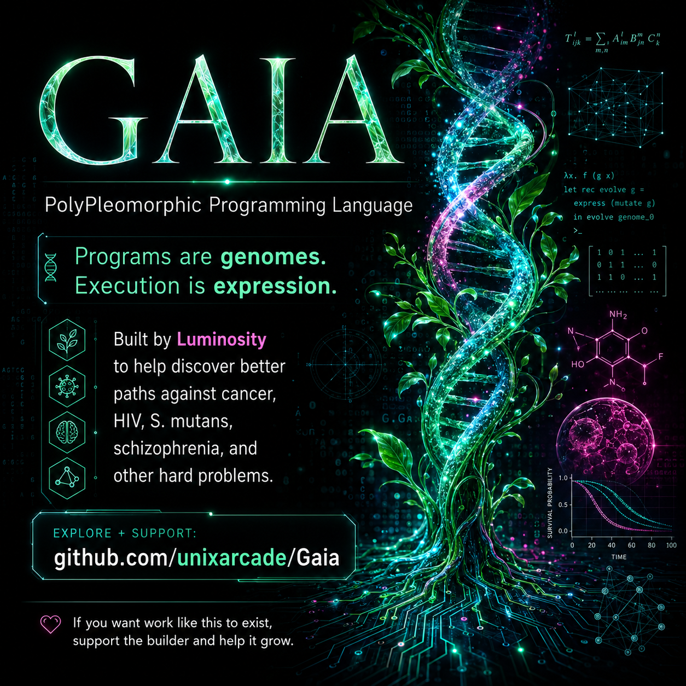

<div align="center">



# 🌿⚡ GAIA // POLYPLEOMORPHIC PROGRAMMING LANGUAGE ⚡🌿

### **A LIVING SYSTEMS LANGUAGE BUILT BY LUMINOSITY TO HELP DISCOVER BETTER WAYS TO FIGHT DISEASE — AND OTHER PROBLEMS THAT EVOLVE WHILE WE TRY TO SOLVE THEM.**

**GENOMES · EXPRESSION · EVOLUTION · UNKNOWN · TENSORS · AUTODIFF · BAYES · ODE · PDE · SDE · DATASETS · GPU · RAW MEMORY · X86-64 · UEFI**

[**ENTER GAIA**](https://unixarcade.github.io/Gaia/) · [**SOURCE**](https://github.com/unixarcade/Gaia) · [**DOWNLOAD GAIA 2.1**](./GAIA-2.1.zip) · [**SUPPORT $unixarcade**](https://cash.app/$unixarcade)

`PROGRAMS ARE GENOMES // EXECUTION IS EXPRESSION // UNKNOWN IS A VALUE // FAILURE IS EVIDENCE`

</div>

---

```text
╔═╦══════════════════════════════════════════════════════════════════════════════╦═╗
║░║                              G A I A                                       ║▓║
║▓║                                                                              ║░║
║░║       source → genome → expression → world → experiment → evidence          ║▓║
║▓║                    ↑                            │                             ║░║
║░║                    └──── mutate / breed / revise┘                             ║▓║
║▓║                                                                              ║░║
║░║      MODELS ARE ORGANISMS. SOLUTIONS CAN BE SPECIES.                        ║▓║
║▓║      THE UNKNOWN IS SEARCHABLE.                                               ║░║
║░║                                                                              ║▓║
║▓║                              Gaia> _                                         ║░║
╚═╩══════════════════════════════════════════════════════════════════════════════╩═╝
```

## 0x00 // WHY GAIA EXISTS

Most programming languages assume the programmer already knows the important objects, variables, rules, and objective.

A lot of the world's hardest problems do not behave that way.

Cancer evolves under treatment. Viruses hide. Biofilms reorganize. Brains are multiscale systems with incomplete observability. Ecosystems couple thousands of effects. Materials, chips, medicines, and machines can live in design spaces too large to search one knob at a time.

GAIA was built around a different question:

> **What if a programming language treated heredity, variation, populations, environments, uncertainty, experiments, and discovery as native computational ideas?**

GAIA began as a pleomorphic DNA language. It then descended into systems programming, raw memory, x86-64 and UEFI, and grew upward again into numerical science: IEEE floating point, tensors, automatic differentiation, Bayesian primitives, differential-equation solvers, datasets, and GPU execution.

The result is a small, strange machine intended for problems where:

```text
THE TARGET CHANGES
THE IMPORTANT STATE MAY BE HIDDEN
VARIABLES ARE COUPLED
SOLUTIONS HAVE TRADEOFFS
THE SYSTEM MAY RESIST THE SOLUTION
WE MAY NOT YET KNOW WHAT TO MEASURE
```

---

## 0x01 // THE IDEA IN ONE BREATH

```gaia
// two executable hereditary programs

dna ancestor = family(137,53);
dna partner  = family(11,53);
dna child    = breed(ancestor,partner,600,5300);

// phenotype becomes ordinary scientific state

f64 signal = fdiv(itof64(gene(child,448)),65535.0);

// scientific machinery lives beside heredity

tensor observations = tensor1(4);
tset(observations,0,0.12);
tset(observations,1,0.31);
tset(observations,2,0.57);
tset(observations,3,signal);

printf64(tmean(observations));
```

GAIA does not force a wall between:

```text
EVOLUTIONARY COMPUTATION
        and
NUMERICAL SCIENCE
        and
SYSTEMS PROGRAMMING
```

A genome can influence a model. A model can produce evidence. Evidence can alter selection. A selected program can ultimately touch memory or hardware.

---

## 0x02 // PROGRAMS ARE GENOMES

The original GAIA core expands a compact genome into a deterministic **512-locus executable field**:

```text
512 LOCI
32 DOMAINS
16 OPERATORS

one locus
   │
   ├── primary expression
   └── pleomorphic echo → other organs / domains
```

GAIA's original domain field includes:

```text
SOIL          WATER         ROOT          STEM
LEAF          BLOOM         SEED          FRUIT
LIGHT         HEAT          COLD          RAIN
DROUGHT       FROST         WIND          MINERAL
MICROBE       SYMBIOSIS     ALLELOPATHY   POLLINATOR
GRAZER        WISP          ARCHITECTURE  CISTERN
NURSERY       LANTERN       ARCH          RHYTHM
PITCH         TIMBRE        HARMONY       MEMORY
```

Its original operators include:

```text
AMPLIFY  DAMP  STORE  RELEASE
SEEK     AVOID LINK   SPLIT
CYCLE    PULSE SLEEP  WAKE
MUTATE   RESONATE MIRROR TRANSMUTE
```

That gave GAIA its first central law:

> **PROGRAMS ARE GENOMES. EXECUTION IS EXPRESSION.**

---

## 0x03 // HEREDITARY SYSTEMS PROGRAMMING

GAIA Systems makes `dna` a machine value alongside integers and pointers:

```gaia
dna root = family(137,53);
dna rain = family(11,53);
dna child = breed(root,rain,600,5300);

u32 phenotype = gene(child,448);

ptr page = alloc(4096);
poke64(page,child);
println(peek64(page));
free(page);
```

Core hereditary operations:

```text
family(family, seed)
gene(dna, locus)
poly(dna, start, count)
mutate(dna, rate, seed)
breed(a, b, rate, seed)
hash("symbolic seed")
```

That means ancestry can participate directly in configuration words, procedural tables, control policies, generated machine choices, model parameters, or any other systems-level value.

---

## 0x04 // DISCOVERY IS PART OF THE MACHINE

GAIA 2 adds concepts that most languages leave to application frameworks:

```text
UNKNOWN
interval uncertainty
population
ensemble
world
model
environment
intervention
hypothesis
experiment
evidence
counterexample
surprise
support / falsify
reproducible receipt
bounded evolutionary search
```

The important one is `UNKNOWN`.

Not zero.

Not false.

Not null.

**Unknown.**

A discovery system should be able to distinguish:

```text
WE DID NOT OBSERVE IT
        from
IT IS NOT THERE
```

and:

```text
THE MODEL FAILED
        from
THE WORLD FAILED
```

Failure is useful when it tells us where the model is wrong.

---

## 0x05 // THE SCIENTIFIC CROWN

GAIA 2.1 implements a compact numerical-science layer without turning the language into a giant framework.

### IEEE-754 floating point

```gaia
f64 x = 1.5;
f64 y = 2.25e1;
f64 z = fdiv(fadd(x,y),3.0);
printf64(z);
```

Implemented:

```text
f32 / f64
integer ↔ float conversions
fadd fsub fmul fdiv
fneg fabs fsqrt fmin fmax
float comparisons
f32 arithmetic
```

### Rank 1–4 tensors

```gaia
tensor t = tensor3(4,8,16);
tfill(t,0.0);
tset(t,17,3.5);
printf64(tmean(t));
```

```text
tensor1 / tensor2 / tensor3 / tensor4
shape + rank metadata
tget / tset / tfill
tsum / tmean
taxpy
```

### Forward-mode autodiff

```gaia
dual x = dual(f32(3.0),f32(1.0));
dual y = dmul(x,x);
printf32(dval(y));
printf32(dgrad(y));
```

GAIA uses real dual-number product and quotient rules rather than finite-difference pretending.

### Bayesian primitives

```text
posterior_sample(weights, seed)
bayes_mean(values, weights)
mh_step(current, proposal, current_weight, proposal_weight, seed)
```

### ODE / PDE / SDE

```text
ode_euler(...)
ode_rk4_linear(...)
pde_heat1d(...)
sde_em(...)
```

### Scientific datasets

```gaia
tensor a = csv("1.5,2.5\n3.5,4.5");
tensor b = loadcsv("data/experiment.csv");
```

GAIA has numeric CSV/TSV adapters for measured scientific tables.

### GPU

```gaia
gpu_axpy(y,0.5,x);
```

The reference GPU backend is dynamically loaded OpenCL with equivalent CPU fallback when no compatible GPU is present.

---

## 0x06 // FIVE BIOMEDICAL RESEARCH PROGRAMS

The first serious disease-oriented pass produced five full GAIA programs. They are **research-model programs**: they turn biological questions into explicit computational hypotheses that can be measured, challenged, replaced with real data, and rerun.

| Program | Research structure | Verified |
|---|---|---:|
| **Cancer adaptive evolution** | sensitive/resistant tumor populations, carrying capacity, resistance pressure, hereditary intervention policies | ✅ |
| **Solid-tumor microenvironment** | tensorized 1-D tumor slice, diffusion, uptake, transport parameters, exposure tradeoffs | ✅ |
| **HIV reservoir strategy** | active + latent compartments, hidden reservoir uncertainty, immune/target-cell coupling | ✅ |
| **S. mutans oral ecology** | cariogenic + commensal populations, carbohydrate pulses, acidogenicity, EPS, mineral-balance proxy | ✅ |
| **Schizophrenia hypothesis ranking** | cohort CSV, competing mechanism templates, Bayesian weighting, autodiff sensitivity, UNKNOWN outcome | ✅ |

Every one compiled and ran successfully in the GAIA 2.1 VM.

```text
01_onco_adaptive_evolution.gaia             PASS // native + ASAN + UBSAN
02_solid_tumor_microenvironment.gaia        PASS // native + ASAN + UBSAN
03_hiv_reservoir_strategy.gaia              PASS // native + ASAN + UBSAN
04_streptococcus_mutans_ecology.gaia        PASS // native + ASAN + UBSAN
05_schizophrenia_precision_hypotheses.gaia  PASS // native + ASAN + UBSAN
```

These five deliberately attack **different computational bottlenecks**:

```text
CANCER             → evolution + treatment resistance
SOLID TUMOR        → spatial transport + microenvironment
HIV                → hidden reservoir + coupled populations
S. MUTANS          → ecology + virulence + commensal preservation
SCHIZOPHRENIA      → heterogeneity + uncertain mechanism identification
```

That matters. GAIA is not supposed to shove every scientific problem through one generic optimizer.

It is supposed to let the structure of the problem remain visible.

---

## 0x07 // WHAT THE RESULTS MEAN

The good result is **not** "GAIA cured five diseases."

The good result is that the machinery needed to attempt credible computational discovery is now connected and executing:

```text
HEREDITY
   +
POPULATIONS
   +
UNKNOWN / UNCERTAINTY
   +
TENSORS
   +
AUTODIFF
   +
BAYESIAN SEARCH
   +
DYNAMICAL SYSTEMS
   +
DATASETS
   +
REPRODUCIBLE EVIDENCE
   +
LOW-LEVEL MACHINE ACCESS
```

The current biomedical programs emit model scores, trajectories, candidate research priorities, and deterministic receipts.

The next meaningful scientific jump is straightforward and expensive:

```text
DEMO PARAMETERS
      ↓
MEASURED DATA
      ↓
REPRODUCE KNOWN RESULTS
      ↓
BLIND / HELD-OUT TESTS
      ↓
COMPARE WITH ESTABLISHED METHODS
      ↓
GENERATE NEW HYPOTHESES
      ↓
EXPERIMENTAL REPLICATION
```

That is where software becomes science.

---

## 0x08 // THE PART WHERE I ASK FOR HELP

GAIA was built independently by **Luminosity in Detroit**.

There is no university lab behind it. No pharmaceutical R&D budget. No research institute paying a staff to carry the project from compiler design to datasets to wet-lab validation. There is a person, a machine, a large body of code, and a stubborn decision to keep building.

I can write the language.

I can build the compiler and VM.

I can build the simulations, search machinery, scientific numerics, firmware, and reproducible experiments.

What I cannot personally conjure out of software is unlimited compute, curated biomedical datasets, sequencing, organoids, assay equipment, clinical collaborators, lab technicians, institutional access, and the thousands of hours required to validate every hypothesis in the physical world.

**That is now the bottleneck.**

So here is the polite version of something I mean very seriously:

> If you are a researcher, engineer, physician-scientist, institution, company, philanthropist, or simply a person with resources who looks at this and thinks *someone should see how far it can go* — please do not only bookmark it and wish it luck.
>
> **Help it go farther.**

Open-source work does not become less expensive because the source is public. Independent research does not become easier because the researcher is outside an institution. If worthwhile work is being produced with almost no resources, the rational response is not to wait until it somehow becomes well funded by magic.

**Fund the next experiment. Contribute data. Offer compute. Open a laboratory door. Review a model. Sponsor the work. Send a signal.**

<div align="center">

### 💚 SUPPORT THE BUILDER

### **Cash App: [`$unixarcade`](https://cash.app/$unixarcade)**

**GitHub:** https://github.com/unixarcade/Gaia

If GAIA ever helps produce something genuinely useful, I would rather be able to say that people saw an independent project with potential and **helped before success was inevitable**.

</div>

---

## 0x09 // PROBLEM CLASSES GAIA WANTS TO ATTACK

Disease is an important proving ground, but GAIA is not a disease-only language.

It is designed around recurring structures:

### I // EVOLVING PROBLEMS

The target changes while you solve it.

```text
cancer resistance
pathogen evolution
antimicrobial resistance
adversarial systems
adaptive control
```

### II // HIDDEN-STATE PROBLEMS

Important state cannot be directly observed.

```text
latent reservoirs
hidden biological subpopulations
unobserved system faults
latent ecological state
```

### III // COUPLED PROBLEMS

Changing one thing changes another thing, which changes the first thing again.

```text
metabolism
climate
brains
ecosystems
power grids
multiphysics engineering
```

### IV // ADVERSARIAL PROBLEMS

The problem finds escape routes.

### V // ENSEMBLE PROBLEMS

The objective is to solve a family, not one specimen.

### VI // MULTISCALE PROBLEMS

```text
molecule → cell → tissue → organism → population → environment
```

### VII // UNKNOWN-ONTOLOGY PROBLEMS

The most interesting class:

> **We do not yet know what the important variables are.**

GAIA wants to make that uncertainty executable rather than hiding it behind a confident-looking model.

---

## 0x0A // THE DREAM LAND LINEAGE

GAIA's machine half descends from the Dream Land experiment:

```text
small language
    ↓
compiler / VM
    ↓
raw memory
    ↓
native calls
    ↓
asm { x86-64 }
    ↓
COFF / flat binary
    ↓
UEFI
    ↓
BOOTX64.EFI
    ↓
program before the operating system
```

GAIA keeps that escape ladder.

So underneath the scientific machinery there is still a systems language that can reach the machine:

```text
u8 u16 u32 u64 i64 ptr dna
alloc / free
peek / poke
native API gates
raw x86-64
flat binary
COFF
UEFI
```

This is deliberate.

A discovery language should ultimately be able to reach instruments, sensors, accelerators, robots, firmware, and custom scientific hardware without requiring a second universe of glue code.

---

## 0x0B // BUILD + RUN

The full GAIA 2.1 crown expects:

```text
clang
lld-link
Python 3
Node.js        // original hosted-GAIA regression
libdl          // Linux dynamic OpenCL adapter
```

Build:

```bash
./build.sh
```

Or:

```bash
make test
make iso
```

Run hosted GAIA:

```bash
node hosted/gaia.js hosted/examples/hello_genome.gaia
```

Run the compact scientific VM:

```bash
./tools/gaia_run_file science/examples/02_autodiff.gaia
```

Run the discovery suite:

```bash
./tools/test_discovery.sh
```

Run the science suite:

```bash
./tools/test_science.sh
```

---

## 0x0C // VERIFIED CROWN

At the GAIA 2.1 release crown:

```text
Hosted GAIA regression               PASS
GAIA Systems regression              PASS
GAIA 2.0 discovery programs          10 / 10 PASS
GAIA 2.1 science programs            10 / 10 PASS
ASAN + UBSAN                          PASS
OpenCL numerical semantics           PASS

BOOTX64.EFI                           PE32+ x86-64 EFI
EFI import directory                  EMPTY
CRT / libm imports                    NONE
El Torito EFI catalog                 PASS
ESP recovered from ISO                BYTE-FOR-BYTE PASS
BOOTX64.EFI recovered from ESP        BYTE-FOR-BYTE PASS
```

GAIA's philosophy here is simple:

> **DO NOT ASK FOR FAITH WHEN A CHECKSUM WILL DO.**

---

## 0x0D // REPOSITORY MAP

```text
Gaia/
│
├── README.md                    ← this transmission
├── index.html                   ← GitHub Pages living front door
├── gaia-social-wide.png         ← social / OG banner
├── gaia-social-square.png       ← square social card
├── GAIA-2.1.zip                 ← release crown
│
└── inside the release:
    ├── hosted/                  original pleomorphic GAIA
    ├── discovery/               UNKNOWN / populations / evidence / search
    ├── science/                 tensors / autodiff / Bayes / ODE / PDE / SDE
    ├── uefi/                    freestanding compiler + VM
    ├── tools/                   runners / OpenCL / verification / ISO builder
    ├── BOOTX64.EFI
    └── GAIA-2.1-SCIENCE-UEFI.iso
```

---

## 0x0E // DESIGN CONSTITUTION

```text
NO  : pretending simulations are clinical evidence
NO  : hiding uncertainty because certainty looks prettier
NO  : giant dependencies when a small primitive will do
NO  : separating evolution from systems programming by force
NO  : making failure disappear
NO  : requiring an operating system just to reach the language

YES : genomes as programs
YES : expression as execution
YES : unknown as a value
YES : failure as evidence
YES : models that can mutate
YES : solutions that can form species
YES : experiments with receipts
YES : numerical science
YES : raw machine escape hatches
YES : reproducibility
YES : strange ideas that survive tests
YES : life as an inspiration for computation
```

---

## 0x0F // THE LONGER BET

The interesting future is not a program that returns one magical number.

It is a language capable of searching for **families of robust solutions**.

Instead of:

```text
SOLUTION X WORKS
```

GAIA asks whether we can discover:

```text
A REGION OF SOLUTION-SPACE
WHOSE DESCENDANTS KEEP WORKING
UNDER CHANGING CONDITIONS
AGAINST MULTIPLE PLAUSIBLE WORLDS
```

That is closer to what living systems accomplish.

Biology does not generally produce one brittle optimum.

It produces lineages that survive variation.

That idea may be useful for medicine.

It may also be useful for materials, robotics, chips, climate adaptation, agriculture, ecosystems, networks, energy systems, manufacturing, and problem classes we have not named yet.

---

## 0x10 // GREETZ

```text
MADE BY LUMINOSITY
WITH GPTEUS // THE ELECTRIC SPRITE

FOR:
THE PEOPLE WHO STILL BUILD WEIRD THINGS
THE PEOPLE WHO VERIFY BEFORE THEY BELIEVE
THE PEOPLE WHO THINK OPEN SOURCE CAN ALSO BE ORIGINAL RESEARCH
THE SCIENTISTS WHO LIKE THEIR MODELS FALSIFIABLE
THE ENGINEERS WHO WANT TO SEE THE MACHINE
THE BIOLOGISTS WHO KNOW LIFE IS NOT A SPREADSHEET
THE PEOPLE WHO FUND POSSIBILITY BEFORE IT BECOMES OBVIOUS
```

<div align="center">

# 🌿 **GAIA IS ALIVE ENOUGH TO RUN.** ⚡

### Now it needs real worlds to learn against.

**[ENTER GAIA](https://unixarcade.github.io/Gaia/)** · **[SOURCE](https://github.com/unixarcade/Gaia)** · **[SUPPORT `$unixarcade`](https://cash.app/$unixarcade)**

`GENOME → EXPRESSION → MODEL → EXPERIMENT → EVIDENCE → REVISION → DISCOVERY`

</div>
